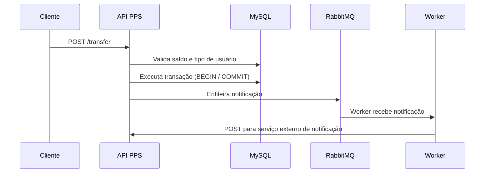
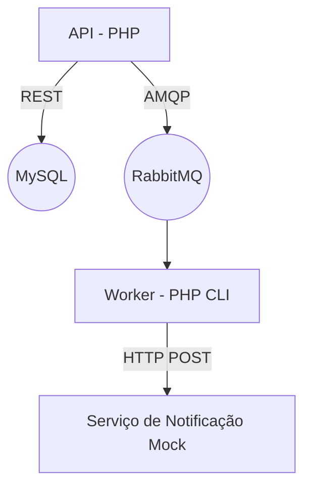
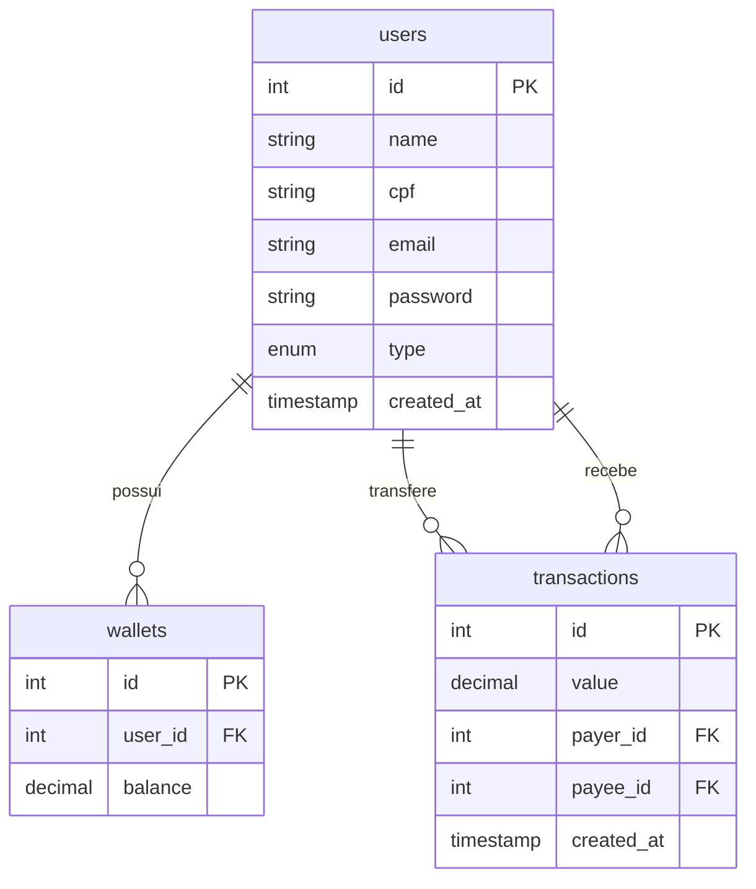

# Plataforma de Pagamentos Simplificada (PPS)

Este projeto é uma aplicação backend para uma plataforma de pagamentos simplificada entre usuários comuns e lojistas. Implementado como um desafio técnico, o foco está em boas práticas, arquitetura escalável, testes e mensageria assíncrona com RabbitMQ.

---

## Tecnologias usadas

- PHP
- Composer
- Docker e Docker Compose
- MySQL
- RabbitMQ
- Monolog
- PHPUnit
- AMQP (php-amqplib)

---

## Componentes

- **API REST**: executa transferências entre usuários
- **RabbitMQ**: processa notificações de forma assíncrona
- **Worker**: escuta a fila `notifications` e envia mensagens para um endpoint mock que randomicamente retorna erro
- **Banco de dados MySQL**: guarda usuários, carteiras e transações
- **Log**: saídas em stdout com Monolog

---

## Como rodar localmente

```bash
git clone https://github.com/ahrocha/pps.git
cd pps
cp .env.exemplo .env
docker-compose up -d --build
```

---

## Endpoint principal

### POST /transfer

```json
{
  "value": 100.0,
  "payer": 1,
  "payee": 2
}
```

- Valida saldo
- Executa transação com rollback
- Enfileira notificação para o recebedor

---

## Fluxo da transferência (Mermaid)



---

## Arquitetura da aplicação (Mermaid)



---

## Testes e Verificação de Qualidade

Para rodar linters e testes automatizados:

```bash
docker exec -it pps_app bash check.sh
```

```bash
docker exec -it pps_app bash -c "php -d display_errors=1 ./vendor/bin/phpunit"
```

---

## Endpoint de Transferência

### POST `/transfer`

**Payload:**

```json
{
  "value": 100.0,
  "payer": 1,
  "payee": 2
}
```

Retorna `200 OK` se a transferência for realizada com sucesso.

---
## Endpoint de Login

### POST `/login`

**Payload:**

```json
{
  "email": "usuário123",
  "password": "senha123"
}
```
**Response:**

```
{
  "token": "seu.jwt.aqui"
}
```

---

Endpoint de Pagamento
### POST `/login`

Headers:
```
Authorization: Bearer seu.jwt.aqui
```

Payload:
```json
{
  "value": 100.0,
  "payee": 15
}
```
---

---
Para gerar o hash de uma senha para o banco de dados, utilize o script, via linha de comando, substituindo a palavra senha do exemplo abaixo:
```
php hash_generator.php senha
```
---


## Diagrama do Banco de Dados



---

## Decisões arquiteturais

- Enfileiramento de notificações com RabbitMQ para desacoplar a operação
- Ack manual no worker para permitir reentregas em caso de falha
- Logs enviados para `stdout` para facilitar observabilidade via Docker

---

## Observações

- Cadastro de usuários não está incluso (foco apenas na transferência)
- A simulação do serviço autorizador e notificador utiliza mocks externos
- As notificações com falha permanecem na fila para nova tentativa
- Adicionado novo endpoint para pagamento por usuário autenticado

## Roadmap
- Limitar a quantidade de requisições por minuto/segundo/ip
- Restringir acesso a rota /transfer:
  - por IP
  - com alguma autenticação e role
- Limitar falhas de notificação e mover para outra fila ou banco de dados
---
