http://localhost:8080/health

# Plataforma de Pagamentos Simplificada (PPS)

Este projeto é uma aplicação backend para uma plataforma de pagamentos simplificada entre usuários comuns e lojistas. Implementado como um desafio técnico, o foco está em boas práticas, arquitetura escalável, testes e mensageria assíncrona com RabbitMQ.

---

## 🚀 Tecnologias usadas

- PHP (puro)
- Composer
- Docker e Docker Compose
- MySQL
- RabbitMQ
- Monolog
- PHPUnit
- PSR-4 (autoload e organização de classes)
- AMQP (php-amqplib)

---

## 🧒‍♂️ Componentes

- **API REST**: executa transferências entre usuários
- **RabbitMQ**: processa notificações de forma assíncrona
- **Worker**: escuta a fila `notifications` e envia mensagens (mockadas)
- **Banco de dados MySQL**: guarda usuários, carteiras e transações
- **Log**: saídas em stdout com Monolog

---

## 📆 Como rodar localmente

```bash
git clone https://github.com/seuusuario/pps.git
cd pps
cp .env.example .env
docker-compose up -d --build
```

Verifique os logs do app e do worker:

```bash
docker logs -f pps_app
docker logs -f pps_worker
```

---

## 📬 Endpoint principal

### POST /transfer

```json
{
  "value": 100.0,
  "payer": 1,
  "payee": 2
}
```

- Valida saldo
- Executa transação com rollback
- Enfileira notificação para o recebedor

---

## 🔄 Fluxo da transferência (Mermaid)

```mermaid
sequenceDiagram
    participant C as Cliente
    participant API as API PPS
    participant DB as MySQL
    participant MQ as RabbitMQ
    participant WK as Worker

    C->>API: POST /transfer
    API->>DB: Valida saldo e tipo de usuário
    API->>DB: Executa transação (BEGIN / COMMIT)
    API->>MQ: Enfileira notificação
    MQ->>WK: Worker recebe notificação
    WK->>API: POST para serviço externo de notificação
```



---

## 🧱 Arquitetura da aplicação (Mermaid)


---

## 🔪 Testes

Para rodar os testes com PHPUnit:

```bash
docker exec -it pps_app vendor/bin/phpunit
```

---

## 📂 Estrutura de pastas

```
app/
├── public/                # Entrada da aplicação (index.php)
├── src/
│   ├── Controllers/
│   ├── Services/
│   ├── Repositories/
│   ├── Handlers/          # Chain of Responsibility
│   ├── Core/              # Config e utilitários (ex: DB, Logger)
│   └── Commands/          # Scripts CLI (ex: worker)
```

---

## 🧠 Decisões arquiteturais

- Uso do padrão **Chain of Responsibility** para modularizar o fluxo de transferência
- Enfileiramento de notificações com RabbitMQ para desacoplar a operação
- Ack manual no worker para permitir reentregas em caso de falha
- Logs enviados para `stdout` para facilitar observabilidade via Docker

---

## 📌 Observações

- Cadastro de usuários não está incluso (foco apenas na transferência)
- A simulação do serviço autorizador e notificador utiliza mocks externos
- As notificações com falha permanecem na fila para nova tentativa

---

## 📃 Licença

MIT - uso livre para fins de estudo ou expansão.

---